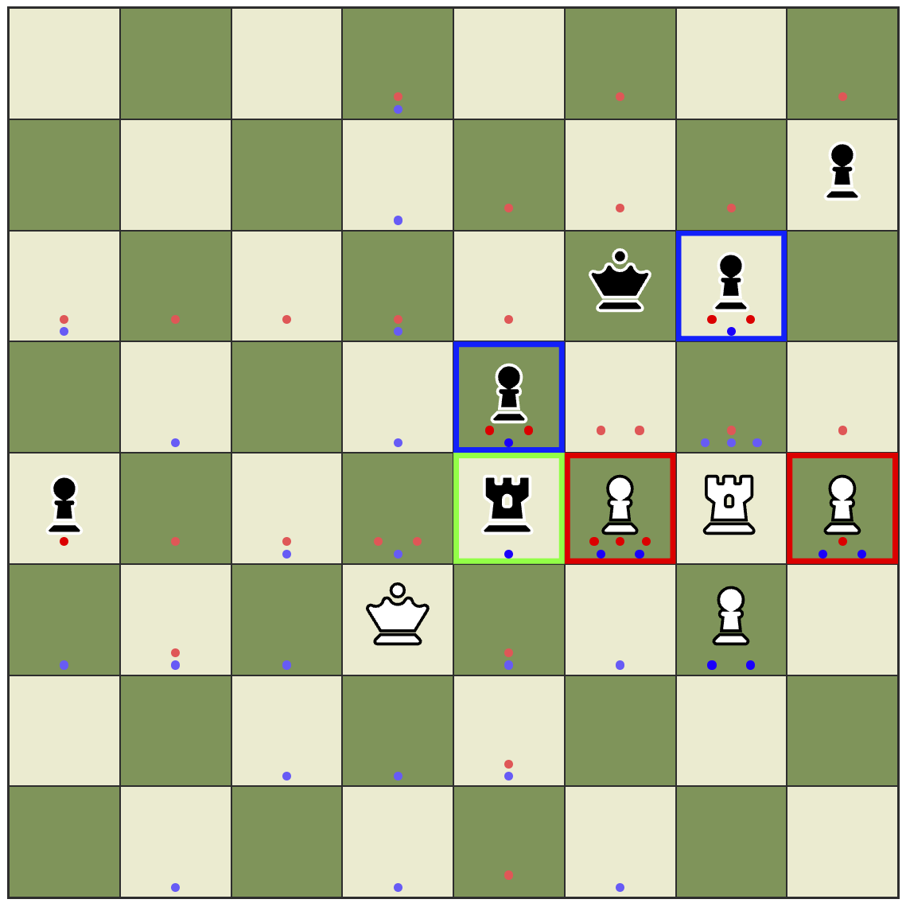

## Chess Helper

This Chess Helper app shows you all the possible moves for any given chess position, showing how many times each square is defended and under attack. It's designed to help new and experienced players, recognise blunders, visualise tactical exchanges, notice attacks and discover opportunities.

You can try it out here: https://oxonomi.github.io/chess-helper--react/

 

Key:
- Red dot shows where your opponent is attacking; meaning the opponent can move a piece to that square, multiple red dots means they can move multiple pieces to that square.
- Blue dots shows where you are defending; where you can move a piece.
- Red outline means your piece is under attack and can be taken.
- Green outline on your opponents piece means you can take it freely.
- Blue outline on your opponents piece means you can take it, but they can take your piece on their next move.
- Yellow outline indicates you have clicked a piece to move it, clicking another square will move the selected piece.
- Pieces can move freely to any square (I did this so you can apply the chess-learner to a pre-existing position without needing to play out every move)
- Click the refresh icon in the top left of the page to cycle through famous chess positions.
- This is not a fully built game, it is companion you can use to copy as you play a game on a dedicated chess platform (please only use this when playing against the computer, do not use against real players as it would be considered cheating).

  
  
*a 'piece' in chess typically refers to only the non-pawn units, but in my explanation I’ve used the word piece to include pawns as colloquial it reads easier for beginners. The correct term to refer to all pieces including pawns is 'unit'*

  
  
To-do
- play as black
- add an undo/redo feature
- create off-board area for won/lost pieces
- add a UI options to replace the dots with a background of progressive opacity
- create an easy way to castle
- create settings for allowing piece movement rules
- link to chess engine to play games
